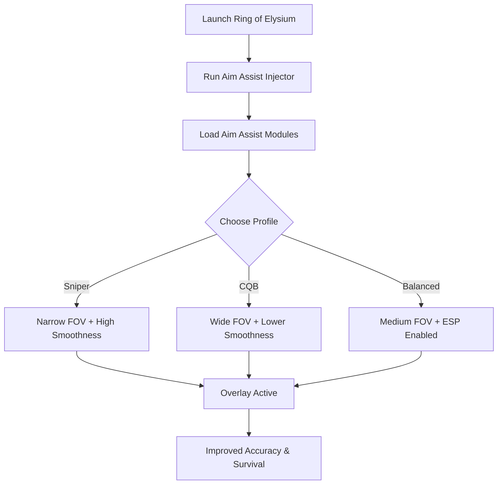

# Ring of Elysium Aim Assist Tool 🎯

Surviving **Ring of Elysium (ROE)** means out-aiming enemies in snowstorms, cable car shootouts, and chaotic close-range fights. The **Ring of Elysium Aim Assist Tool** provides **configurable targeting, recoil stabilization, and optional ESP overlays**, helping you stay precise in every survival scenario.

---

## 🌐 Overview

This isn’t a one-size-fits-all trainer. You can customize **FOV, smoothness, and bone targeting** to fit sniping, close-quarters combat, or balanced playstyles. Save multiple configs and switch instantly with hotkeys, so you’re always prepared—whether defending rooftops or hunting in the snow.

---

## 🔑 Features

* 🎯 **Smooth Aim Assist** – Adjustable tracking for human-like precision.
* 👁 **Optional ESP Overlay** – Highlight enemies, loot, and vehicles.
* ⚡ **Recoil Stabilizer** – Reduces weapon kick for consistent aim.
* 🗂 **Profile Manager** – Save sniper, CQB, or hybrid setups.
* ⌨️ **Hotkey Switching** – Instantly swap profiles in combat.
* 🔒 **Stealth Injection** – Lightweight, low-detection loader for Windows.

---

[](#)
[](#)
[](#)
[](#)

---

## 🖥 Compatibility

| Platform       | Status        | Notes                    |
| -------------- | ------------- | ------------------------ |
| Windows 10     | ✅ Supported   | Stable aim assist builds |
| Windows 11     | ✅ Optimized   | Best overlay performance |
| Linux (Proton) | ⚠️ Limited    | ESP only, assist partial |
| macOS          | ❌ Unsupported | VM workaround required   |

\[!NOTE]
Runs best on **Windows 10/11** with DirectX overlays.

---

## ⚙️ Setup Guide

1. Download the Aim Assist package.

2. Extract files into a secure folder.

3. Launch Ring of Elysium.

4. Run the injector as administrator:

   ```bash
   roe_aimassist.exe -game roe.exe -mode stealth
   ```

5. Customize your `config.ini`:

   ```ini
   [AimAssist]
   FOV=90
   Smoothness=6
   Target=Chest
   Hotkey=Mouse4

   [ESP]
   Enemies=True
   Vehicles=True
   EnemyColor=Red
   VehicleColor=Green
   ```

6. Use `Insert` to toggle overlay in-game.

\[!IMPORTANT]
Inject **after game startup** to prevent failed attachment.

---

## 📊 Workflow Diagram



---

## 🎚 Example Configurations

**Sniper Profile:**

```ini
FOV=35
Smoothness=9
Target=Head
```

**Close Quarters Profile:**

```ini
FOV=120
Smoothness=4
Target=Chest
```

**Balanced Profile:**

```ini
FOV=85
Smoothness=6
Target=Chest
ESP=True
```

\[!WARNING]
Wide FOV + no smoothing may look robotic and raise detection risks.

---

## ❓ FAQ

**Q: Does aim assist reduce FPS?**
A: No, it’s lightweight with <3% frame impact.

**Q: Can I save multiple configs?**
A: Yes, you can hotkey-switch between them mid-match.

**Q: Does it work with controllers?**
A: Limited—best results with mouse/keyboard.

**Q: How often is it updated?**
A: Updates release alongside ROE patches.

**Q: Is stealth injection completely safe?**
A: It minimizes detection but is never 100% undetectable.

---

## 🚀 Final Thoughts

The **Ring of Elysium Aim Assist Tool** delivers **precision targeting, recoil control, and optional ESP awareness** in one streamlined package. Whether you’re sniping across snowy ridges or surviving chaotic close-range duels, it ensures accuracy when it matters most.

[](#)
[](#)
[](#)

---
